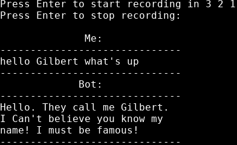
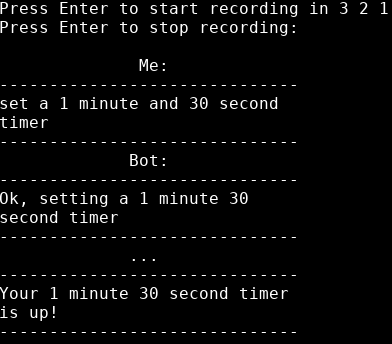

# Virtual Assistant:

## Table of contents
* [Overview](#overview)
* [Examples](#examples)
* [Technologies](#technologies)
* [Setup](#setup)
* [Limitations](#limitations)

## Overview
This is a python based virtual assistant that can respond to greetings and can also set timers. The bot works by running the program which will start the voice recording. The recording can be stopped by pressing enter. Your voice will then be translated to text by the Google speech recognition API and replied to by the bot.

## Examples
### Screenshots of Terminal

> Greeting response

> Setting a timer

## Technologies
- **Python 3.8**
- **SpeechRecognition 3.8**
  - api for parsing speach to text
- **sounddevice 0.3**
  - get recording from microphone
  - reading *.wav* file
- **wavio 0.0.4**
  - write recording to *.wav* file

Note this method does not use PyAudio which must be manually compiled. Instead, by using these technologies, all the requirements are contained within the [requirements.txt](requirements.txt) file

## Setup
To run this project, install the requirements and then run the program:

    pip3 install -r requirements
    python voiceRecognition.py

## Limitations
- [ ] if the audio cannot be recognised, it's up to the user to fix their microphone troubles
  - there is testing for what channels and sample rates are supported but that doesn't guarantee it to work
- [ ] sometimes the audio recording is sped up

## License
Licensed under the [GNU General Public License v3.0](LICENSE)
